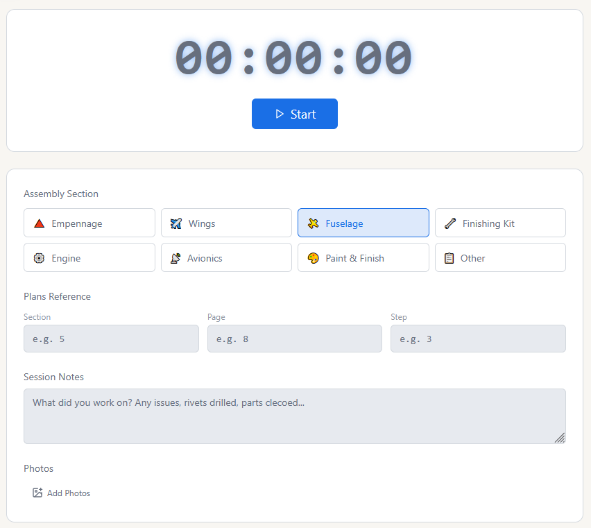
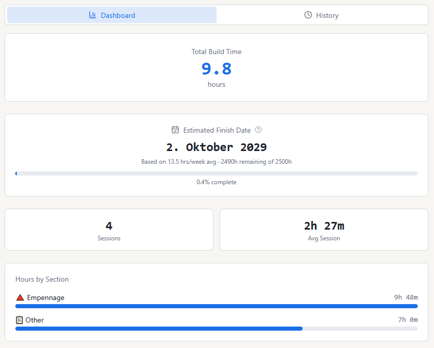
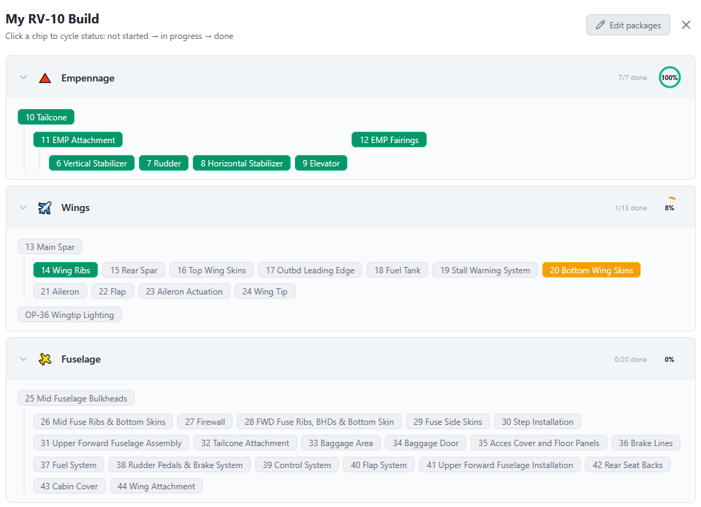
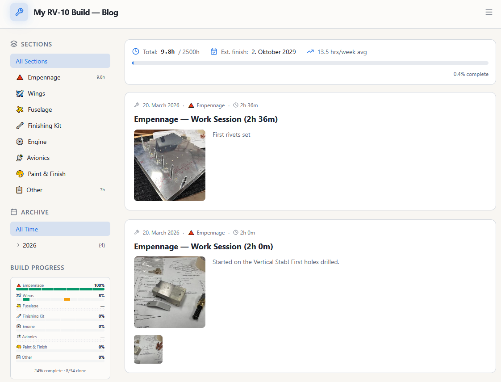
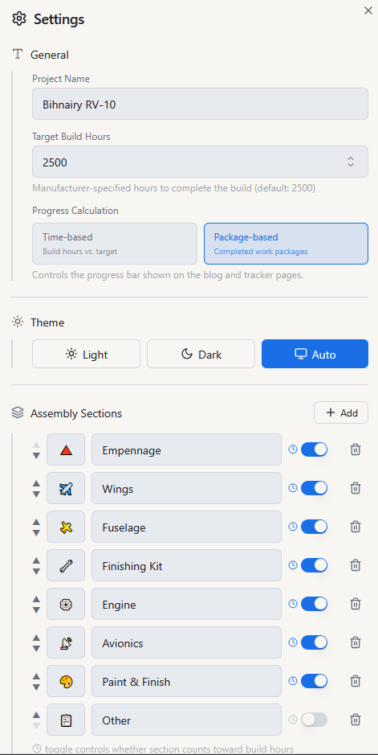
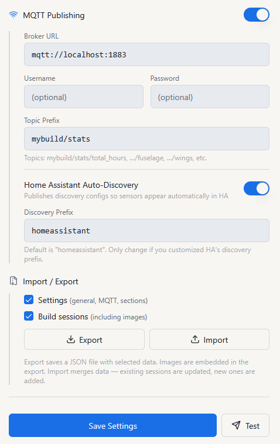
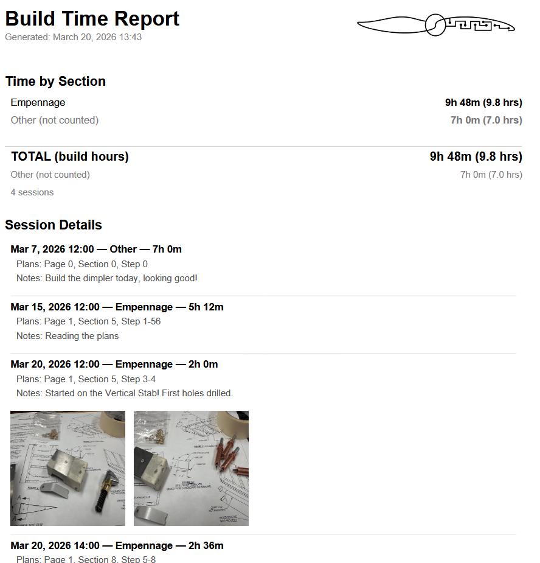

# Benchlog

A self-hosted web application for tracking a homebuilt aircraft (or any large construction project). Log build sessions, document your work through a public blog, visualize package-level progress, and monitor everything from a clean dashboard — all running on your own infrastructure.

Originally built for a [Van's RV-10](https://www.vansaircraft.com/rv-10/) build.

---

## Features

### ⏱ Time Tracker

- **Server-side timer** — start a session from the UI; the timer runs on the server and survives page refreshes or browser restarts
- **Section tagging** — assign each session to an assembly section (Empennage, Wings, Fuselage, etc.)
- **Plans reference** — log the Section, Page, and Step number from the manufacturer's plans
- **Session notes** — free-text notes on what was accomplished
- **Photo attachments** — upload photos per session; images are automatically resized on upload (configurable max width, default 1920px) and thumbnails are generated for fast loading
- **Manual entry** — add sessions retrospectively with full date, duration, section, and photo support



---

### 📊 Dashboard

- Total build hours, session count, and average session duration
- Estimated finish date based on rolling weekly pace
- Progress bar (time-based or package-based — switchable in Settings)
- Hours broken down by assembly section with a visual bar chart
- Sections marked as non-billable (e.g. "Other") are excluded from totals and averages



---

### 🏗 Build Progress Tracker

Organize your entire build into a tree of **work packages**, mirroring the structure of the manufacturer's plans.

- Packages are grouped by **Assembly Section** and can be nested to any depth
- Hierarchy is visualized with connecting lines between parent and child packages
- Click a chip to cycle its status: **Not Started → In Progress → Done**
- Per-section circular completion indicator (0 – 100%)
- Drag and drop packages to reorder or reparent them in edit mode
- Rename packages inline
- Deletion of packages with children requires confirmation

#### 🔗 Build Progress → Blog Integration

Work packages named with a leading section number (e.g. **"10 Tailcone"**, **"7 Rudder"**) are linked directly to the build blog. Hovering a chip in the progress overview reveals a **blog icon** — clicking it closes the overlay and instantly filters the blog to show all posts and sessions referencing that plans section. This makes the build tracker a live index into your build journal.



---

### 📝 Build Blog / Journal

- Write rich build log entries with a full editor (headings, bold, italic, lists, links, inline images)
- **Work sessions automatically appear as blog posts** — no double entry required
- Edit session posts directly from the blog (timing, section, notes, plans reference, photos)
- Filter posts by **assembly section** or browse by **month** in the collapsible archive sidebar
- **Public read access** — share your entire build log with the community, no login required
- Image uploads supported in both blog posts and session posts



---

### ⚙️ Settings

- **Project name** and **target build hours** (default: 2500h for an RV-10)
- **Progress calculation mode** — time-based (hours logged vs. target) or package-based (completed work packages)
- **Image resizing** — configure maximum upload width or disable resizing entirely
- **Assembly Sections** — add, remove, reorder, and set emoji icons; toggle whether a section counts toward total build hours
- **Theme** — Light, Dark, or system default (Auto)
- **MQTT publishing** — publish build stats to any MQTT broker after every session:
  - Total hours, progress %, session count, last session images
  - Per-section hours (one topic per section)
- **Home Assistant Auto-Discovery** — sensors appear in HA automatically without YAML configuration
- **Export / Import** — full JSON backup and restore including sessions, settings, flowchart state, and base64-embedded images

| General Settings | MQTT & Export |
|---|---|
|  |  |

---

### 📄 Build Report

Generate a formatted report of your build sessions as a **PDF** or plain text file.

- Choose between **chronological** or **grouped by section** order
- Optionally include **plans references**, **session notes**, and **session photos** (PDF only)
- **Non-billable sections** (e.g. "Other") can be included separately — clearly marked as not counted toward build hours
- **Custom logo** — a logo is placed top-right on the PDF cover; replace or upload your own during export
- Section summary with billable total shown in the dialog before generating



---

### 🔐 Authentication

- Single-user password setup on first run
- JWT Bearer tokens (72-hour expiry)
- **Public read access** for the blog, stats, and build progress — authenticated write access for everything else

---

## Tech Stack

| Layer | Technology |
|---|---|
| Frontend | React 18, TypeScript, Vite, Tailwind CSS, shadcn/ui (Radix UI) |
| Backend | Node.js, Express (CommonJS) |
| Database | SQLite via `better-sqlite3` |
| Image Processing | `sharp` (server-side resize + thumbnail generation) |
| Auth | Custom JWT (HS256), SHA-256 password hash |
| Deployment | Docker + docker-compose |
| Home Automation | MQTT (Home Assistant integration) |

---

## Getting Started

### Prerequisites

- [Docker](https://docs.docker.com/get-docker/) and [Docker Compose](https://docs.docker.com/compose/)
- Optionally: an MQTT broker for Home Assistant integration

### Quick Start with Docker Compose

The easiest way to run Benchlog is using the pre-built image from the GitHub Container Registry. The `stable` tag is recommended — it is manually promoted by the maintainer after testing and always reflects a vetted release:

```yaml
# docker-compose.yml
services:
  benchlog:
    image: ghcr.io/tsag1337/benchlog:stable
    container_name: benchlog
    restart: unless-stopped
    ports:
      - "3010:3001"
    volumes:
      - ./data:/data
    environment:
      PORT: 3001
      DB_PATH: /data/database.db
```

```bash
docker compose up -d
```

The app is then available at `http://localhost:3010`.

On first visit you will be prompted to set a password. After that, log in to access the timer, dashboard, and settings. The blog at `/blog` is always publicly accessible.

**To upgrade**, update the tag in your `docker-compose.yml` to the new version and run:

```bash
docker compose pull && docker compose up -d
```

Check the [Releases page](https://github.com/tsag1337/benchlog/releases) for available versions and changelogs.

> **Choosing a tag**
>
> | Tag | Behaviour | Recommended for |
> |---|---|---|
> | `1.0.0` | Exact release — never changes | Production (pinned) |
> | `1` | Auto-updates within v1.x.x — gets new features and fixes, never a breaking v2 | Users who want updates without surprises |
> | `stable` | Manually promoted by the maintainer after testing — always a vetted release | **Most users** |
> | `latest` | Tracks the `main` branch — may include unreleased changes | Development / testing only |

### Build from Source

```bash
git clone https://github.com/tsag1337/benchlog.git
cd benchlog
docker compose up -d --build
```

### Local Development

```bash
# Install dependencies
npm install
cd server && npm install && cd ..

# Start the backend
cd server && node index.js &

# Start the frontend dev server
npm run dev
```

Set `VITE_API_URL=http://localhost:3001` in a `.env.local` file so the frontend connects to the local backend.

---

## Environment Variables

| Variable | Default | Description |
|---|---|---|
| `PORT` | `3001` | HTTP server port |
| `DB_PATH` | `./data/database.db` | Path to SQLite database file |
| `JWT_SECRET` | *(auto-generated)* | Secret key for signing JWT tokens. If not set, a random secret is generated on first run and saved to `/data/.jwt_secret` so it persists across restarts. |

---

## API Reference

### Public endpoints (no auth required)

| Method | Path | Description |
|---|---|---|
| GET | `/api/sessions` | List all work sessions |
| GET | `/api/stats` | Build stats (total hours, progress %, est. finish) |
| GET | `/api/blog` | List blog posts (includes sessions as posts) |
| GET | `/api/blog/:id` | Get a single blog post |
| GET | `/api/settings/general` | General settings (project name, target hours) |
| GET | `/api/sections` | Assembly section configuration |
| GET | `/api/flowchart-status` | Build progress package statuses |
| GET | `/api/flowchart-packages` | Build progress package tree |
| GET | `/api/timer/status` | Current timer state |
| GET | `/files/:object` | Serve uploaded images |

### Authenticated endpoints (Bearer token required)

| Method | Path | Description |
|---|---|---|
| POST | `/api/sessions` | Create a work session |
| PUT | `/api/sessions/:id` | Update a session |
| DELETE | `/api/sessions/:id` | Delete a session |
| POST | `/api/timer/start` | Start the server-side timer |
| POST | `/api/timer/stop` | Stop the timer and save the session |
| POST | `/api/upload` | Upload an image (multipart/form-data) |
| DELETE | `/api/upload` | Delete an uploaded image |
| POST | `/api/blog` | Create a blog post |
| PUT | `/api/blog/:id` | Update a blog post |
| DELETE | `/api/blog/:id` | Delete a blog post |
| PUT | `/api/settings/general` | Update general settings |
| GET | `/api/settings/mqtt` | Get MQTT settings |
| PUT | `/api/settings/mqtt` | Update MQTT settings |
| POST | `/api/settings/mqtt/test` | Publish a test MQTT message |
| PUT | `/api/sections` | Update assembly section configuration |
| PUT | `/api/flowchart-status` | Update build progress statuses |
| PUT | `/api/flowchart-packages` | Update build progress package tree |
| GET | `/api/export` | Export full backup (JSON with embedded images) |
| POST | `/api/import` | Restore from a backup |
| POST | `/api/auth/login` | Authenticate and receive a JWT |
| POST | `/api/auth/setup` | Set the initial password (first run only) |

---

## Data Persistence

All data is stored in a single SQLite database at the path specified by `DB_PATH`. When using Docker, mount a host directory to `/data` so data survives container restarts:

```yaml
volumes:
  - ./data:/data
```

Uploaded images are stored inside the `/data` volume alongside the database, so a single volume mount covers everything. The Export function embeds all images as base64 in the JSON backup so you can restore everything from a single file.

---

## Home Assistant Integration

Enable MQTT publishing in Settings and point it at your broker. After each session the tracker publishes:

| Topic | Value |
|---|---|
| `{prefix}/total_hours` | Total logged hours |
| `{prefix}/build_progress` | Progress percentage |
| `{prefix}/total_sessions` | Number of sessions |
| `{prefix}/last_session_images` | JSON array of image URLs |
| `{prefix}/{section_id}` | Hours per assembly section |

Enable **Home Assistant Auto-Discovery** to have sensors appear in HA automatically without any manual YAML configuration.

---

## License

This project is licensed under the [PolyForm Noncommercial License 1.0](LICENSE).
Free for personal and non-commercial use. Contributions are subject to the [Contributor License Agreement](CLA.md).

> Looking for a commercial license? [Contact me](mailto:) for inquiries regarding commercial use or acquisition.

---

*Not affiliated with Van's Aircraft, Inc.*
